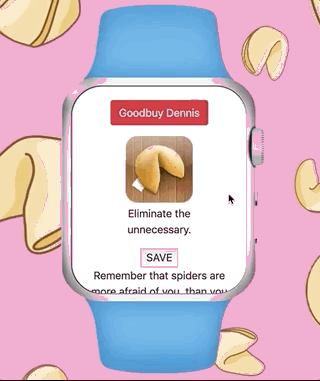
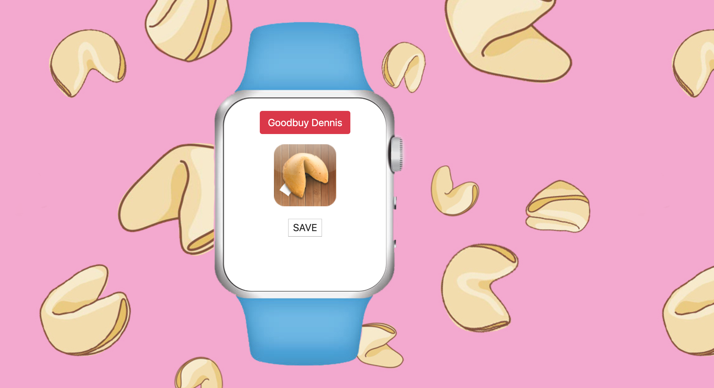
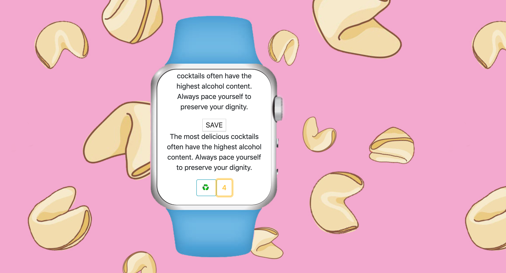

## Cookie Rama `Updated 12.5.2019`

This is a small and powerful app, that will guide you through dark waters of complicated decisions. Just with one touch you can ask a bit of advice and receive a message from a fortune cookie teller. A short but inspirational quote will make your day.      

### `Goals of this project`

1. Master DOM manipulation and Master Rails.
2. Build a simple and concise app with a responsive design.
3. Work with external [API](https://fortunecookie.docs.apiary.io/#introduction/authentication).

### `Tech stack`

1. Back-end built with Rails.

### `Run this App`

1. Rails part should run on http://localhost:3003 (for custom port use this -> "bundle exec puma -C config/puma.rb -b tcp://127.0.0.1:3003")
2. To run a Front-end part -> just open index.html from this repo in browser.

### ` What you can do with Cookie Rama app?`

1. Register as a new user. 
2. Existing users log-in only with a username. 
3. Every user can ask for a new fortune cookie quote, save it to favorites, update a list of favorites quotes, like any number times any number of quotes. 

### `Thanks`

Thank you [Annie Souza](https://github.com/luanesouza), [Randy Herasme](https://github.com/randyher) and [Graham Troyer-Joy](https://github.com/telegraham) for support, professionalism, and patience. Thank you for seeing me and every student as a partner in learning and sharing. 
